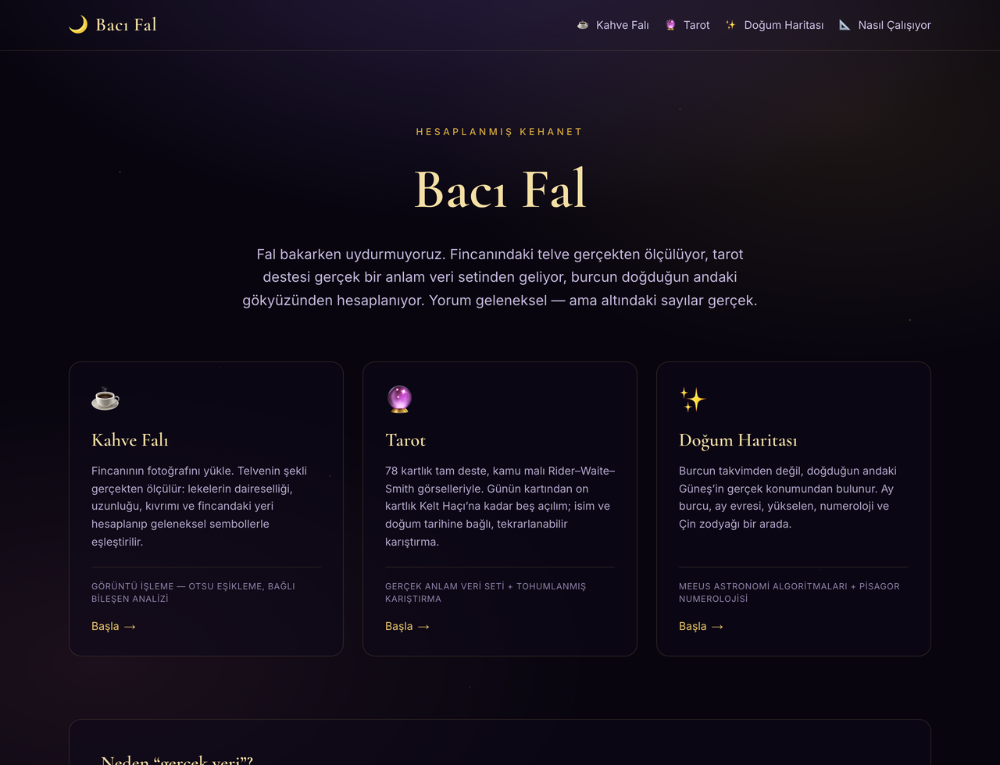
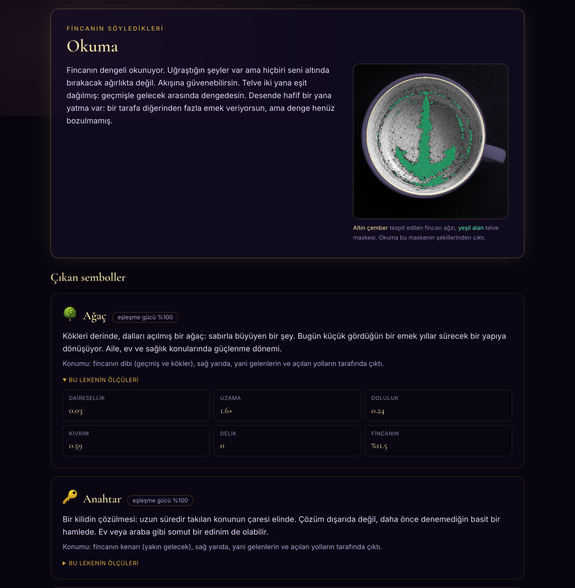
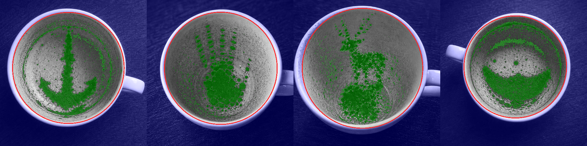
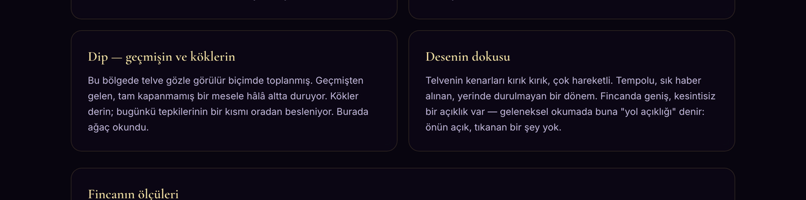
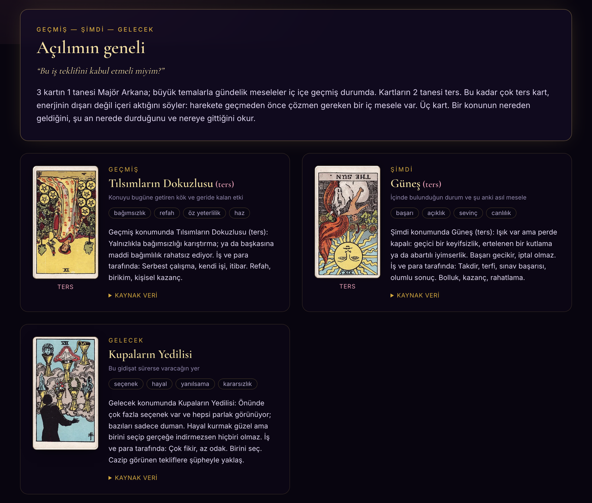
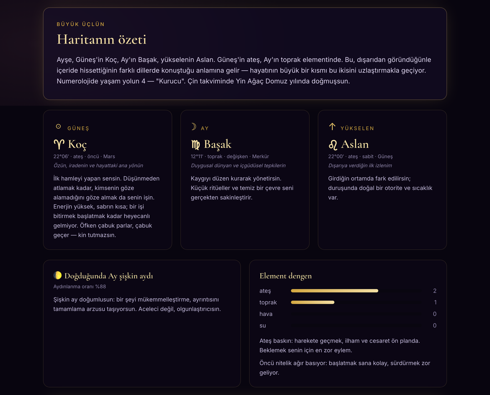
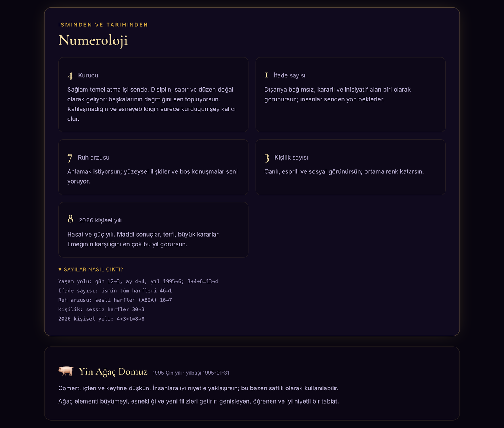
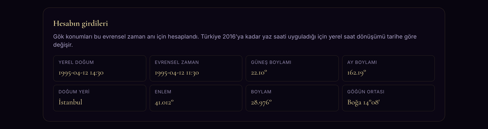
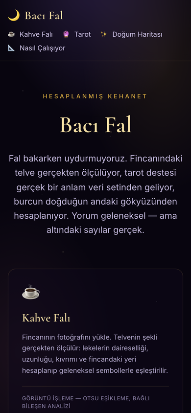

<div align="center">

# 🌙 Bacı Fal

**Kahve falı, tarot ve doğum haritası — hesabı gerçek olan bir fal sitesi.**

Fincanındaki telve gerçekten ölçülüyor · Tarot destesi yayımlanmış bir veri setinden geliyor · Burcun doğduğun andaki gök konumundan hesaplanıyor

### 👉 **[Siteyi aç: sultanuyarr.github.io/baci-fal](https://sultanuyarr.github.io/baci-fal/)**

Kurulum yok, üyelik yok, sunucu yok — **her şey tarayıcında çalışıyor.**
Yüklediğin fincan fotoğrafı cihazından hiç çıkmıyor.

<br>



</div>

<br>

Fal eğlencelidir; ama arkasındaki sayıların uydurma olması gerekmez. Bu projede
her sonucun altında gerçek bir hesap var ve o hesabı sitede görebiliyorsun.

---

## ☕ Kahve falı — fotoğrafın gerçekten okunuyor

Fincanının fotoğrafını yüklüyorsun; **tarayıcın** görüntüyü bir tuvale çizip
piksellerini okuyor, telve lekelerinin geometrisini ölçüyor ve ölçüleri
geleneksel sembollerin tarifleriyle eşleştiriyor. Fotoğraf hiçbir yere
gönderilmiyor.



Okumanın yanında **fotoğrafında ne gördüğü** duruyor: altın çember tespit edilen
fincan ağzı, yeşil alan telve maskesi. Her sembolün altında da o lekenin
**gerçek ölçüleri** var — dairesellik 0.03, uzama 1.6×, delik 0, fincanın
%11.5'i. Sembol bu sayılar yüzünden seçildi.

### Farklı fincanlar, farklı maskeler

Aynı boru hattı dört ayrı fotoğrafta (denetim betiğinin çıktısı — kırmızı
çember fincan ağzı, yeşil alan telve):



<sub>Fincan fotoğrafları: Coffee Insights / [Tasseography.org](https://tasseography.org),
Wikimedia Commons, [CC BY-SA 4.0](https://creativecommons.org/licenses/by-sa/4.0/).
Yukarıdaki türev görsel de aynı lisansla paylaşılmaktadır.</sub>

### Boru hattı

| Adım | Ne yapılıyor |
|---|---|
| 1. Hazırlık | EXIF yönü, 460 px'e ölçekleme, gri tonlama, kontrast germe |
| 2. Fincanı bulma | Porselenin parlak piksellerinin en büyük bağlı bileşeni alınır, içindeki telve boşlukları doldurulur; merkezden 180 yöne atılan ışınların **ortancası** yarıçapı verir — böylece kulp ve tabak ölçüyü şişirmez |
| 3. Telveyi ayırma | Fincan içi histogramına Otsu eşiklemesi. Koyu sınıf diskin %38'inden fazlaysa eşik **ikinci kez** hesaplanır; yoksa ince kahve tabakası telve sanılır |
| 4. Lekeleri ölçme | Bağlı bileşen analizi → dairesellik (4πA/Dz), ikinci momentlerden uzama, kutu doldurma oranı, konveks kabuğa göre kıvrım, kayda değer delik sayısı ve delik alan oranı |
| 5. Eşleştirme | 34 geleneksel sembolün her birinin ölçülebilir bir imzası var; leke hangi imzaya ne kadar uyuyorsa o kadar puan alır |
| 6. Bölge okuması | Kenar (yakın gelecek), orta (şimdi), dip (geçmiş); sağ (gelenler), sol (gidenler) |

Örnek bir sembol imzası — yüzük:

```json
{
  "id": "yuzuk", "ad": "Yüzük",
  "imza": {
    "delik": [1, 3], "delikOrani": [0.28, 0.9],
    "dairesellik": [0.05, 0.7], "uzama": [1.0, 2.0],
    "doluluk": [0.2, 0.7], "alanOrani": [0.004, 0.06]
  },
  "bolge": ["kenar", "orta"]
}
```

**Hiçbir adımda rastgele sayı yok.** Aynı fotoğrafı yüz kez yükle, yüz kez aynı
falı alırsın; farklı bir fotoğraf farklı ölçüler verdiği için farklı okunur.



---

## 🔮 Tarot — 78 kart, tam deste



- **Anlamlar:** Mark McElroy, _A Guide to Tarot Card Meanings_
  ([dariusk/corpora](https://github.com/dariusk/corpora) veri seti). Her kartın
  özgün anahtar kelimeleri ve aydınlık/gölge anlamları sitede "Kaynak veri"
  başlığı altında olduğu gibi gösterilir; Türkçe okumalar bunun üzerine yazılmış
  ayrı bir katmandır.
- **Görseller:** Rider–Waite–Smith destesi (1909), Pamela Colman Smith — kamu
  malı, Wikimedia Commons'tan indirildi.
- **Karıştırma:** isim + doğum tarihi + soru + gün + tur numarası `xmur3` ile 32
  bitlik tohuma çevrilir; deste bu tohumla beslenen `mulberry32` üretecinin
  yönlendirdiği **Fisher–Yates** algoritmasıyla karılır. Aynı girdi aynı açılımı
  verir — sayfayı yenilemek falını değiştirmez.
- **Açılımlar:** Günün Kartı · Evet/Hayır · Geçmiş–Şimdi–Gelecek · İlişki
  Açılımı · Kelt Haçı (10 kart)

Ters kartlar gölge anlamıyla okunur ve açılım özeti gerçek bileşimden türer:
kaç Majör Arkana çıktığı, hangi takımın baskın olduğu, kaç kartın ters geldiği.

---

## ✨ Doğum haritası — gerçek gökyüzü



Jean Meeus, _Astronomical Algorithms_ (2. baskı) yöntemleriyle:

- **Güneş burcu** doğum anındaki gerçek ekliptik boylamdan (~0,01° doğruluk).
  Sabit tarih aralığı kullanılmadığı için burç sınırında doğanlar doğru sonucu alır.
- **Ay burcu, evresi ve aydınlanma oranı** (~0,1° doğruluk)
- **Yükselen ve göğün ortası** — yerel yıldız zamanı, ekliptik eğikliği ve doğum
  ilinin enlem/boylamıyla
- **Saat dilimi** — Türkiye 2016'ya kadar yaz saati uyguladığı için yerel saat,
  tarihe uygun ofsetle evrensel zamana çevrilir
- **Çin zodyağı** — sabit tablo değil: kış gündönümünü içeren ay ayı bulunur,
  **artık ay kuralı** uygulanır, ay başları Çin yerel gününe (UTC+8) göre alınır

### Numeroloji — hesabı görünür



Türkçe alfabeye uyarlanmış Pisagor sistemi (Ç→C, Ğ→G, İ→I, Ö→O, Ş→S, Ü→U;
sesliler A E I İ O Ö U Ü). 11, 22 ve 33 usta sayı olarak korunur ve indirgenmez.

### Kullanılan girdiler açıkça yazılı



---

## 📱 Mobil

<div align="center">
  
</div>

---

## 🚀 Kurulum

```bash
git clone https://github.com/sultanuyarr/baci-fal.git
cd baci-fal
npm install
npm run dev          # http://localhost:3000
```

Statik siteyi yerelde üretmek için:

```bash
npm run build        # çıktı: out/
```

Veri dosyaları depoda hazır gelir. Yeniden çekmek istersen:

```bash
npm run veri:tarot   # 78 kart anlamı + kamu malı kart görselleri
npm run veri:iller   # 81 ilin koordinatları (Wikidata)
```

## ✅ Testler

```bash
npm test
```

**73 test.** Hesapların doğruluğu dışarıdan bilinen değerlerle sınanıyor —
"çalışıyor gibi görünüyor" yetmez:

| Ne sınanıyor | Referans |
|---|---|
| Güneş boylamı | Meeus örnek 25.a — 1992-10-13 → 199,90895° |
| Ay boylamı | Meeus örnek 47.a — 1992-04-12 → 133,162655° |
| Yıldız zamanı | Meeus örnek 12.a — 1987-04-10 → 197,693195° |
| Ekliptik eğikliği | Meeus örnek 22.a — 1987-04-10 → 23,440946° |
| Yeni ay anı | Meeus örnek 49.a — dakika hassasiyetinde |
| Ekinoks / gündönümü | 2024 ilkbahar ekinoksu ve kış gündönümü, saat isabetiyle |
| Çin yılbaşı | 1984, 1996, 2000, 2015, 2020, 2023–2026, 2033 (artık ay istisnası) |
| Şekil ölçümleri | Sentetik daire (dairesellik > 0,85), çizgi (uzama > 10), üçgen (kutu doldurma ≈ 0,5), halka (1 delik), yay (kıvrım > 0,5) |
| Yaz saati geçmişi | 1990 kışı UTC+2, 1990 yazı UTC+3, 2020 yıl boyu UTC+3 |
| Karıştırma dağılımı | 7800 açılımda ilk kartın 78 olasılığa düzgün dağılımı |
| Belirlenimcilik | Aynı fotoğraf → aynı fal; aynı girdi → aynı açılım ve harita |

## 🔍 Görsel denetim

Kahve falı segmentasyonunu gözle kontrol etmek için:

```bash
npm run kahve:denetim -- fotograf.jpg [...] --cikti denetim.png
```

Tespit edilen fincan dairesi kırmızı, telve maskesi yeşil çizilir. Yukarıdaki
segmentasyon görselini bu komut üretti.

## 📁 Yapı

```
app/
  page.tsx               Ana sayfa
  kahve|tarot|dogum/     Sayfalar ve istemci formları
  nasil/                 Yöntem ve kaynaklar sayfası
components/
  Panel.tsx              Ortak arayüz parçaları
  TelveHaritasi.tsx      Tespit edilen fincan ve telve maskesini çizen tuval
lib/
  altyol.ts              GitHub Pages alt dizini için varlık adresleri
  kahve/goruntu.ts       Saf görüntü analizi (platformdan bağımsız)
  kahve/cozucu-tarayici.ts  Canvas ile fotoğraf çözme
  kahve/cozucu-node.ts   sharp ile fotoğraf çözme (testler)
  kahve/semboller.ts     Sembol eşleştirme
  kahve/yorum.ts         Okuma metni
  tarot/deste.ts         78 kartlık deste (kaynak veri + Türkçe katman)
  tarot/rastgele.ts      Tohumlanmış karıştırma (xmur3 + mulberry32)
  tarot/acilim.ts        Açılımlar ve sentez
  dogum/gokbilim.ts      Meeus algoritmaları
  dogum/burc.ts          Burç verileri
  dogum/cin.ts           Çin takvimi (gerçek yeni ay hesabı)
  dogum/numeroloji.ts    Pisagor numerolojisi
  dogum/harita.ts        Hepsini birleştiren harita
data/                    Tarot verisi, sembol sözlüğü, il koordinatları
scripts/                 Veri çekme ve görsel denetim betikleri
tests/                   Vitest test takımı
.github/workflows/       Pages'e otomatik yayın
```

## 🚢 Yayın

`main` dalına her push'ta GitHub Actions testleri çalıştırır, siteyi statik
olarak derler ve GitHub Pages'e yayınlar. Yapılandırma:
[`.github/workflows/pages.yml`](.github/workflows/pages.yml)

Kendi hesabında yayınlamak istersen `next.config.ts` içindeki `altYol`
değerini deponun adıyla değiştirmen yeterli.

## 🛠 Teknoloji

Next.js 16 (App Router, statik dışa aktarım) · TypeScript · Tailwind CSS 4 ·
Canvas API · Vitest · GitHub Actions ile GitHub Pages'e otomatik yayın

`sharp` yalnızca geliştirme bağımlılığıdır: testlerde ve görsel denetim
betiğinde fotoğraf çözmek için kullanılır, yayınlanan siteye girmez.

## 🔒 Gizlilik

**Sunucu yok.** Site yalnızca statik dosyalardan ibaret; kahve falı, tarot ve
doğum haritası hesaplarının tamamı senin tarayıcında çalışıyor.

- Yüklediğin fotoğraf hiçbir yere gönderilmez — Canvas ile okunur, cihazında işlenir
- İsim, doğum tarihi ve doğum yeri hiçbir yere kaydedilmez
- Veritabanı, çerez, izleme kodu yok
- Sayfa açıldıktan sonra internet bağlantını kesip fal baktırabilirsin; yine çalışır

Aynı analiz kodu hem tarayıcıda hem testlerde çalışır: görüntü işleme ham piksel
dizisi üzerinde saf hesap yapar, platforma bağlı tek şey fotoğrafın çözülmesidir
([`cozucu-tarayici.ts`](lib/kahve/cozucu-tarayici.ts) /
[`cozucu-node.ts`](lib/kahve/cozucu-node.ts)).

## 📜 Kaynaklar ve lisans

| Ne | Kaynak | Lisans |
|---|---|---|
| Tarot kart görselleri | Rider–Waite–Smith destesi (1909), Pamela Colman Smith | Kamu malı |
| Tarot kart anlamları | Mark McElroy, _A Guide to Tarot Card Meanings_ (dariusk/corpora) | Veri setinin kendi koşulları |
| İl koordinatları | [Wikidata](https://www.wikidata.org) (Q48336, P625) | CC0 |
| Gök hesapları | Jean Meeus, _Astronomical Algorithms_, 2. baskı | Algoritmalar kitaptan uygulandı |
| README'deki fincan fotoğrafları | Coffee Insights / Tasseography.org, Wikimedia Commons | CC BY-SA 4.0 |

Projenin kendi kodu MIT lisanslıdır.

---

> Bacı Fal eğlence amaçlıdır. Ölçümler gerçek, kaynaklar açık, hesaplar
> denetlenebilir — ama telvenin şeklinden geleceğin okunabileceğine dair
> bilimsel bir kanıt yok. Sağlık, hukuk ve para konularında bir uzmana danışın.
>
> Fincan yol gösterir, yolu yürüyen sensin. 🌙
